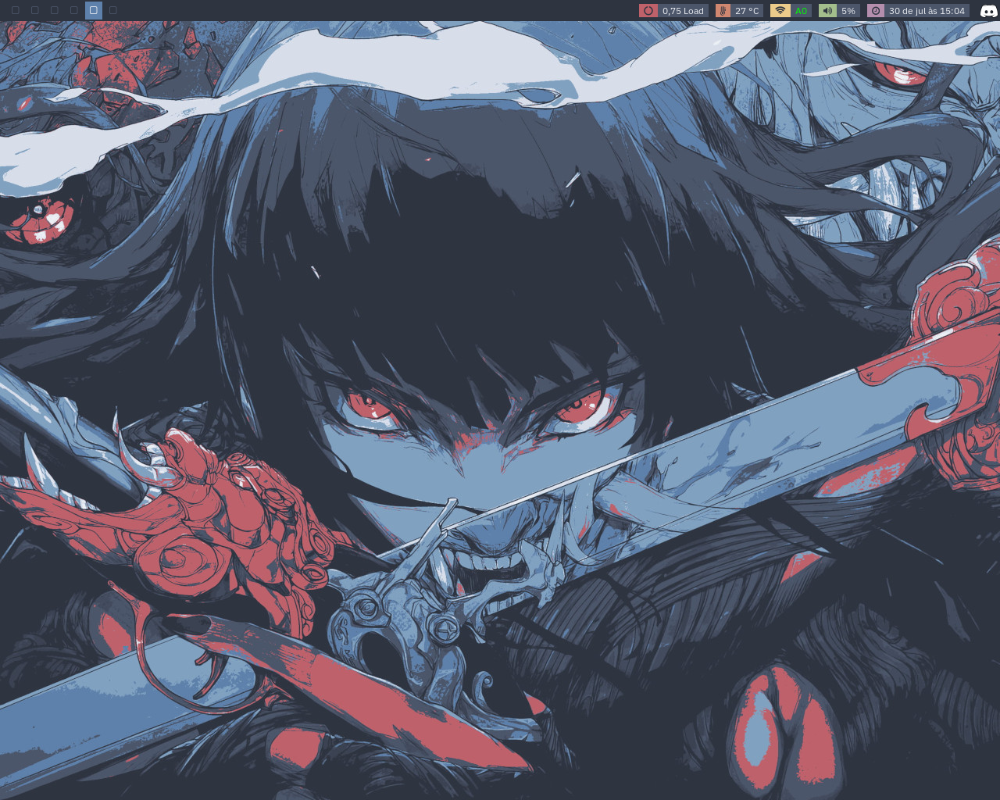
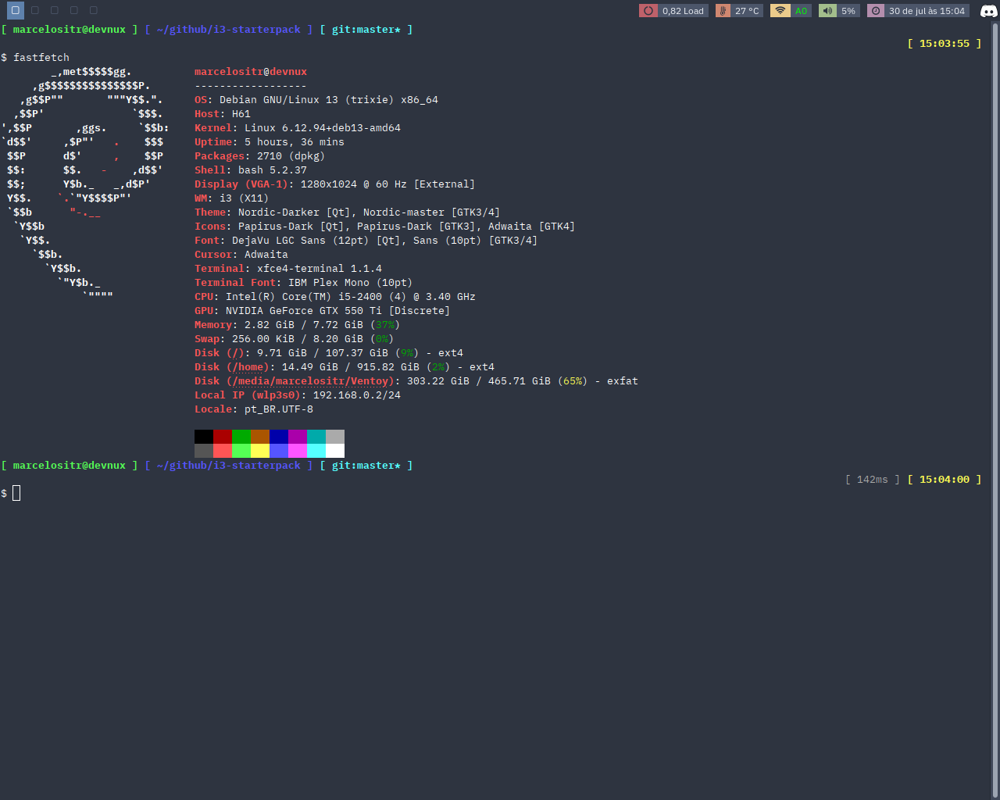
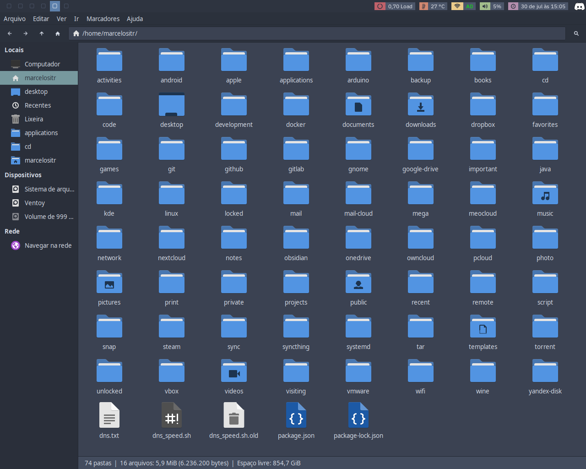

# i3 Starterpack

Configuração pessoal do i3 para Debian, derivada do projeto
[addy-dclxvi/i3-starterpack](https://github.com/addy-dclxvi/i3-starterpack).
O foco é um ambiente leve com i3, Thunar, XFCE Terminal, tema Nordic e scripts
de apoio.

## Conteúdo

- configuração do i3 e i3status;
- Bash prompt, Nano e Emacs;
- preferências GTK, Qt, Thunar e XFCE Terminal;
- tema Nordic, configuração Kvantum e Symbols Nerd Font;
- scripts para screenshot, criptografia, descriptografia e assinatura GPG.

O Papirus Icon Theme deixou de ser armazenado aqui. Ele deve ser instalado pelo
gerenciador de pacotes, evitando mais de cem mil arquivos copiados do sistema.

## Dependências principais no Debian

Os nomes abaixo correspondem aos pacotes normalmente usados no Debian 13:

```bash
sudo apt install i3-wm i3status suckless-tools hsetroot scrot i3lock \
  brightnessctl alsa-utils thunar xfce4-terminal exo-utils gocryptfs fuse3 \
  gnupg libimage-exiftool-perl papirus-icon-theme qt5ct qt6ct \
  fonts-ibm-plex aspell aspell-pt-br
```

Kvantum e Emacs são opcionais e podem ser instalados conforme a versão
disponível na distribuição.

## Instalação

Faça backup dos arquivos atuais antes de copiar qualquer configuração. Este
repositório contém dotfiles completos e não deve ser despejado sobre `$HOME`
com um `cp -r` no modo kamikaze.

Os caminhos esperados são:

- configurações em `$HOME/.config`;
- temas, fontes e wallpapers em `$HOME/.local/share`;
- scripts executáveis em `$HOME/script`;
- `.bashrc`, `.profile`, `.nanorc` e `.face` diretamente em `$HOME`.

Depois de instalar as fontes, atualize o cache com `fc-cache -fv` e ajuste em
`.config/i3status/config` a interface Wi-Fi e o sensor térmico da máquina.

## GPG

Por padrão, os scripts usam `marcelost@riseup.net`. É possível trocar as chaves
sem editar os arquivos:

- `GPG_RECIPIENT` define o destinatário da criptografia;
- `GPG_SIGNING_KEY` define a chave usada para assinatura.

## Validação

Execute:

```bash
./script/validate
```

O andamento das melhorias fica registrado em [docs/ROADMAP.md](docs/ROADMAP.md)
e os componentes externos estão documentados em
[THIRD_PARTY.md](THIRD_PARTY.md).

## Capturas




